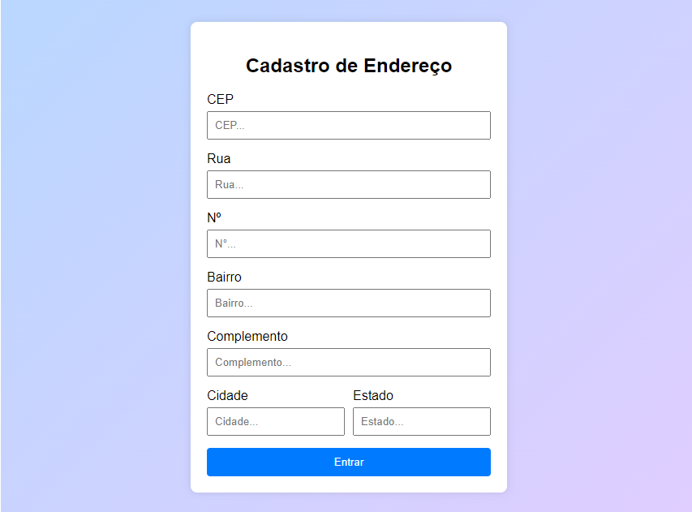
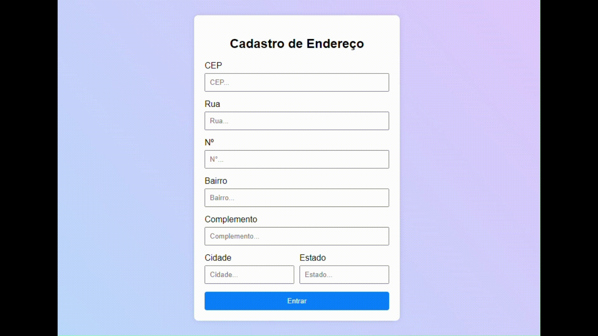

# Cadastro de Endereço
## Índice
1. [Descrição](#descrição)
2. [Introdução](#introdução)
3. [Funcionalidades](#funcionalidades)
4. [Interface](#interface)
5. [Tecnologias Utilizadas](#tecnologias-utilizadas)
6. [Referências](#referências)
7. [Funções do JavaScript](#funções-do-javascript)

## Descrição
Esse projeto é um formulário de cadastro de endereço que permite ao usuário inserir informações como CEP, rua, número, bairro, cidade, estado e complemento. O sistema usa a API ViaCEP para preencher automaticamente os campos de endereço com base no CEP que você digitar.

## Introdução
O Cadastro de Endereço foi criado para facilitar a inserção de dados de endereço. Ele ajuda os usuários a obter informações corretas usando só o CEP. Esse projeto é perfeito para apps que precisam registrar endereços, como serviços de entrega ou cadastro de usuários.

## Funcionalidades
- **Validação de CEP:** O sistema verifica se o CEP que você colocou é válido antes de buscar na API.
- **Preenchimento automático:** Usa a API ViaCEP para preencher os campos do endereço com os dados que vierem do CEP.
- **Limpeza de formulário:** Limpa tudo antes de preencher com novas informações.
- **Alertas:** Informa se o CEP não for encontrado ou se for inválido.
## Interface

A interface é bem simples e fácil de usar, feita para ser responsiva e amigável. O formulário fica centralizado na tela e os campos estão organizados para facilitar a inserção de dados.

## Tecnologias Utilizadas
- **HTML:** Estruturação do formulário.
- **CSS:** Estilização da interface, com layouts legais e animações.
- **JavaScript:** Lógica do aplicativo, incluindo validação de dados e comunicação com a API.

## Referências
- [API ViaCEP](https://viacep.com.br/) - API que usamos para pegar informações de endereço a partir do CEP.

## Funções do JavaScript
### 1. `limparFormulario()`
Essa função limpa todos os campos do formulário (logradouro, bairro, localidade, uf, número e complemento) para que você possa colocar novos dados sem que nada interfira.
### 2. `eNumero(numero)`
Essa função verifica se a entrada que você deu tem só números, usando uma expressão regular. Retorna `true` se for um número válido e `false` se não for.
### 3. `cepValido(cep)`
Essa função confere se o CEP que você digitou tem exatamente 8 dígitos e se é só números. Retorna `true` se for válido e `false` se não for.
### 4. `preencherFormulario(endereco)`
Essa função preenche os campos do formulário com os dados do endereço que a API devolve. Ela recebe um objeto `endereco` como parâmetro, que contém informações como logradouro, bairro, localidade e uf.
### 5. `pesquisarCep()`
Essa função é assíncrona e faz a busca na API ViaCEP com base no CEP que você digitou. Antes de fazer a requisição, ela limpa o formulário e verifica se o CEP é válido. Se o CEP for encontrado, chama a função `preencherFormulario()` para preencher os campos com os dados. Se não for encontrado, exibe um alerta dizendo que o CEP não foi encontrado.
### 6. `document.getElementById('cep').addEventListener('focusout', pesquisarCep)`
Esse código adiciona um evento ao campo de CEP, chamando a função `pesquisarCep()` quando você sai do campo, permitindo que os dados sejam preenchidos automaticamente depois que você digitar o CEP.
### 7. `fetch(url)`
A função `fetch` é usada para fazer uma requisição HTTP para a URL que você passou e retorna uma `Promise` que resolve com a resposta da requisição. É uma maneira moderna de fazer chamadas para APIs e permite que você faça requisições assíncronas.
### 8. `await`
O `await` é usado para esperar que uma `Promise` seja resolvida. Você pode usar isso só dentro de funções assíncronas (marcadas com `async`). Quando você coloca `await` antes de uma chamada a `fetch`, o código espera até que a resposta da requisição chegue, tornando tudo mais fácil de entender e lidando com operações assíncronas de forma mais sequencial.